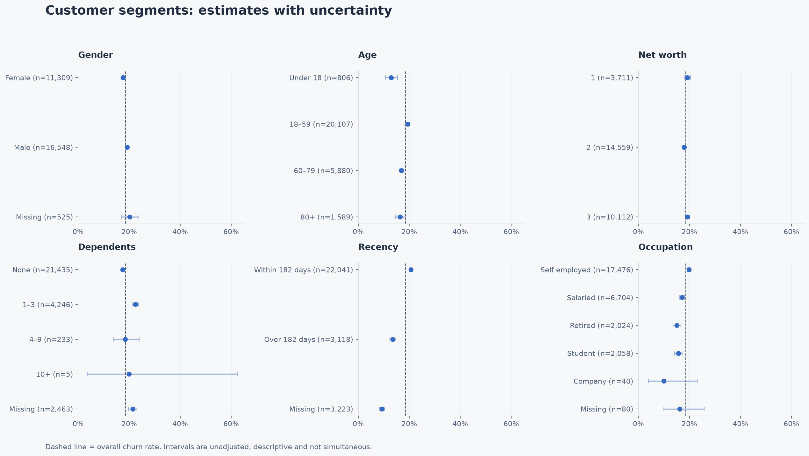
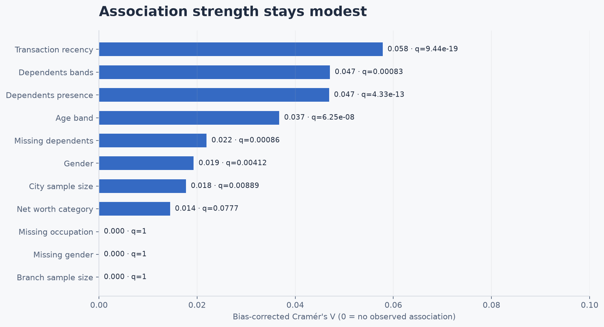

# Bank Customer Churn Analysis

An exploratory study of **28,382 bank customer records** using a Jupyter notebook. It examines demographics, account activity, missing information and financial behaviour, with clear charts and reproducible statistical results.

[](https://colab.research.google.com/github/harsh-github007/Analysis_Churn/blob/main/Churn_analysis.ipynb)

## Main findings

- **5,260 customers churned: 18.53%.** The notebook reports the numerator, denominator and a 95% Wilson interval.
- **Single categorical associations are small.** The largest ordinary Cramér's V among the eleven tests is 0.058, for transaction recency.
- **Recent activity has a higher observed churn rate**, but the event timing and mechanism are unknown. This does not establish that activity causes churn or that dormant accounts are protected.
- **Seven of eleven tests remain below q = 0.05** after Benjamini–Yekutieli adjustment. Net worth does not pass the adjusted threshold. Statistical evidence and practical effect size are reported separately.
- **Small groups need caution.** Only five customers have ten or more dependents; their wide interval is shown rather than treated as a dependable segment.
- **Missing information is not zero.** The analysis explicitly recognizes the CSV's `NaT` date sentinel, includes unknown groups in descriptive charts, and reports exclusions for each association test.
- **Balances and transaction flows form different correlation clusters.** The notebook also compares financial medians and interquartile ranges by churn without discarding extreme records.



All panels share the same percentage scale. Dashed lines show the overall rate; intervals are individual, descriptive intervals rather than simultaneous comparisons.

## What the notebook includes

1. **Data audit:** schema, unique customers, binary labels, valid dates, missing values and negative balances.
2. **Baseline:** customer counts, churn rate and uncertainty.
3. **Segment comparisons:** rates, group sizes and Wilson intervals for demographics and recency.
4. **Eleven association tests:** expected-cell diagnostics, Monte Carlo tests for sparse tables, ordinary and bias-corrected Cramér's V, and adjusted p-values.
5. **Sensitivity checks:** vary the arbitrary sample-size cutoffs for cities and branches.
6. **Missingness:** recorded versus absent information, with denominators and uncertainty.
7. **Financial behaviour:** signed-log display of skewed distributions, pairwise Spearman correlations with available-pair counts, financial medians and interquartile ranges.
8. **Conclusions:** limits of the evidence and a concrete path toward prospective modelling.



## Data and interpretation

[`churn_analysis.csv`](churn_analysis.csv) contains 21 original fields: customer identifiers, demographics, branch and city codes, account vintage, balances, credits, debits, last transaction date and the `churn` flag. The source CSV is preserved unchanged.

Recency uses **31 December 2019**, with an exploratory 182-day split. City and branch groups describe the number of customer records in this sample, not population or real branch capacity. Dependents are not household size; net worth codes are not verified income brackets. Missing categories remain visible in descriptive summaries and are excluded from substantive association tests, with exclusions reported.

The repository does not document the original sampling process, precise churn definition or feature/event timing. Results describe this sample. They do not establish causation, intervention effectiveness or future predictive accuracy. A predictive model should follow confirmation of label timing and a genuine future-period validation set.

## Run the analysis

In Colab, choose **Runtime → Run all**. The notebook installs its analysis dependencies when running in Colab and downloads the CSV if no local copy exists.

Locally, use Python 3.11 or newer:

```bash
python -m venv .venv
# macOS / Linux
source .venv/bin/activate
# Windows PowerShell: .\.venv\Scripts\Activate.ps1
python -m pip install -r requirements.txt
jupyter lab Churn_analysis.ipynb
```

Run every cell in order. The committed notebook includes executed outputs, so its analysis can also be read directly on GitHub.

## Reproducible outputs

The notebook writes six charts, CSV result tables and a run manifest into [`reports`](reports/). Useful outputs include:

- [Segment rates and intervals](reports/segment_rates.csv)
- [Eleven tests, effect sizes and adjusted p-values](reports/hypothesis_tests.csv)
- [Data quality](reports/data_quality.csv) and [missingness rates](reports/missingness_rates.csv)
- [Cutoff sensitivity](reports/size_cutoff_sensitivity.csv)
- [Financial summaries](reports/financial_summary.csv), [comparisons by churn](reports/financial_by_churn.csv), [correlations](reports/spearman_correlations.csv) and [pair counts](reports/correlation_pair_counts.csv)
- [Run manifest](reports/run_manifest.json): dataset SHA-256, date reference, random seed, resample count and package versions.

The full notebook was executed locally. Integrity assertions check row counts, customer IDs, segment denominators, interval bounds, the eleven-test family and unchanged input data.

## Statistical methods

Wilson score intervals are individual 95% binomial intervals. Association tests use uncorrected Pearson χ²; when any expected cell is below five, a fixed-seed Monte Carlo test uses 9,999 fixed-margin tables. The eleven overlapping tests use Benjamini–Yekutieli adjustment to account for multiple comparisons under dependence. Monte Carlo p-values have finite resampling resolution.

References: [SciPy contingency tests](https://docs.scipy.org/doc/scipy/reference/generated/scipy.stats.contingency.chi2_contingency.html), [SciPy false-discovery control](https://docs.scipy.org/doc/scipy/reference/generated/scipy.stats.false_discovery_control.html), and [Bergsma's bias correction for Cramér's V](https://doi.org/10.1016/j.jkss.2012.10.002).
